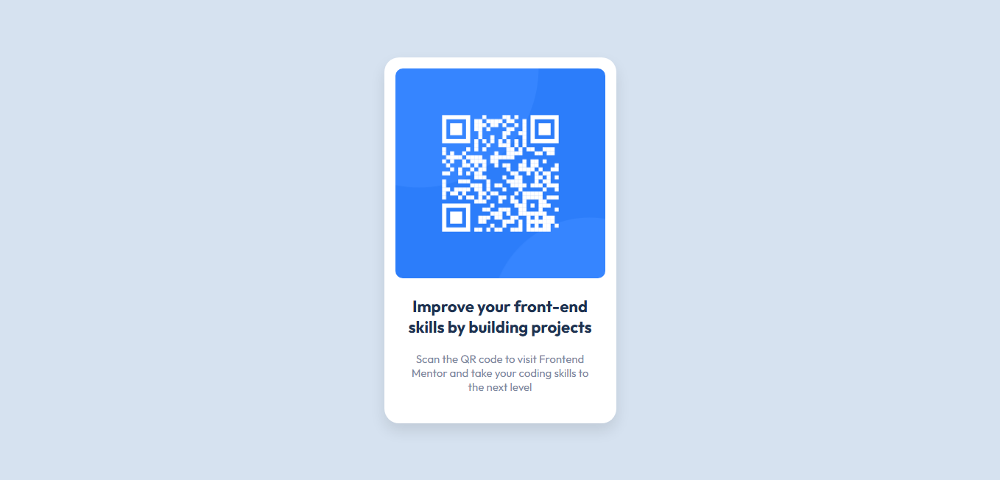

# Frontend Mentor - QR code component solution

This is a solution to the [QR code component challenge on Frontend Mentor](https://www.frontendmentor.io/challenges/qr-code-component-iux_sIO_H). Frontend Mentor challenges help you improve your coding skills by building realistic projects.

## Table of contents

- [Overview](#overview)
  - [Screenshot](#screenshot)
  - [Links](#links)
- [My process](#my-process)
  - [Built with](#built-with)
  - [What I learned](#what-i-learned)
  - [Continued development](#continued-development)
  - [Useful resources](#useful-resources)
- [Author](#author)

**Note: Delete this note and update the table of contents based on what sections you keep.**

## Overview

### Screenshot



### Links

- Solution URL: [https://github.com/Ahmed-Abdul-ghaffar/qr-code-component](https://github.com/Ahmed-Abdul-ghaffar/qr-code-component)
- Live Site URL: [https://ahmed-abdul-ghaffar.github.io/](https://ahmed-abdul-ghaffar.github.io/)

## My process

### Built with

- Semantic HTML5 markup
- CSS for styling
- Flexbox for layout and alignment
- Mobile-first workflow
- Google Fonts for typography
- CSS Box Model for spacing and borders

### What I learned

I learned to add favicon, which is an icon associated with a webpage displayed in the browser's tab next to the page title.Here's how you can add a favicon:

```html
<link rel="icon" type="image/png" href="images/favicon-32x32.png" />
```

I also learned how to use a font family which is not installed in my device. Here's how you can use a font family form [google fonts](https://fonts.google.com/).

```html
<link rel="preconnect" href="https://fonts.googleapis.com" />
<link rel="preconnect" href="https://fonts.gstatic.com" crossorigin />
<link
  href="https://fonts.googleapis.com/css2?family=Outfit:wght@100..900&display=swap"
  rel="stylesheet"
/>
```

```css
body {
  font-family: "Outfit", sans-serif;
  font-optical-sizing: auto;
  font-style: normal;
}
```

I also learned how to center the content vertically.Here's how you can do this.

```css
body {
  display: flex;
  align-items: center;
  height: 100vh;
}
```

### Continued development

God willing, I plan to focus on CSS layouts, particularly Flexbox, as I used it to vertically center my page in this project. Additionally, I aim to improve my skills in creating pixel-perfect applications that are consistent across both mobile and desktop designs.

### Useful resources

- [ChatGPT by OpenAI](https://openai.com/chatgpt/) - ChatGPT provided guidance on centering elements with Flexbox. This assistance was crucial in enhancing the quality of this project.
- [Google Fonts](https://fonts.google.com/) - Google Fonts was used to implement the "Outfit" font, which improved the typography and overall visual appeal of the project. This resource is excellent for accessing a wide variety of free fonts for web development.

## Author

- Frontend Mentor - [@Ahmed-Abdul-ghaffar](https://www.frontendmentor.io/profile/Ahmed-Abdul-ghaffar)

- GitHub - [ahmed-abdul-ghaffar](https://github.com/ahmed-abdul-ghaffar)

- LinkedIn - [Ahmed Abdul-ghaffar](https://www.linkedin.com/in/ahmed-abdul-ghaffar-79535b23a/)
